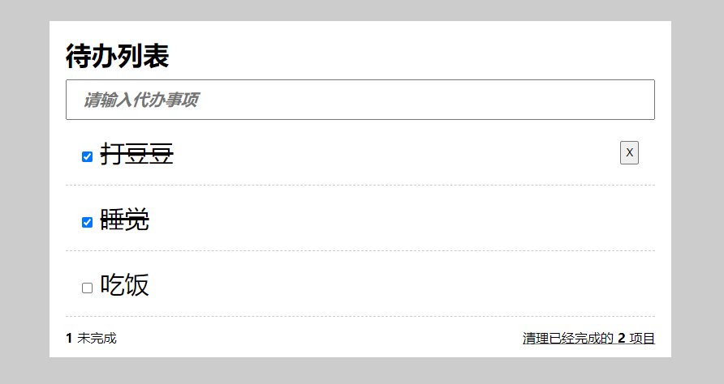
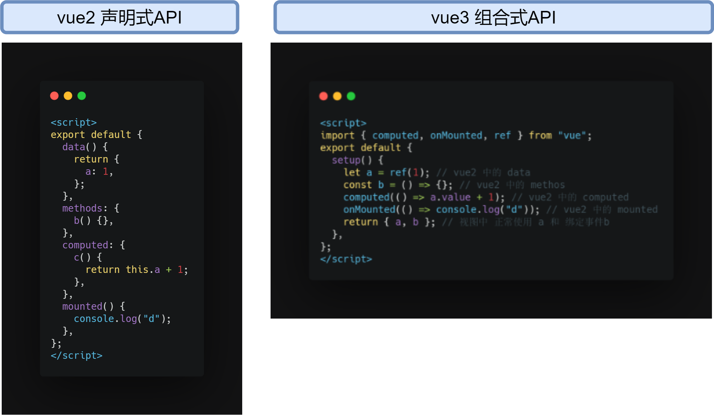

# 十分钟 带你强势入门 vue3
## 案例效果图




## vue3 介绍

自从去年v3推出以来，发现我不会 `vue3` 都没有办法和周边朋友愉快聊天了，不会 `vue3` 就相等于没有朋友！

## 和 vue2  有什么区别

开发者最直观的感受应该就是

以前 `vue2` 是 `东市买骏马西市买鞍鞯`，分门，虽然要跑一段路，但是起码目标路径清晰。

现在 `vue3` 是 不管什么分门别类了，专门给你开个 鸡店马店，一个店把配置所有都搞定。 专业术语叫 **组合式API**，放羊屁就是 **Composition API**

[以上见解参考官网](https://vue3js.cn/docs/zh/guide/composition-api-introduction.html#什么是组合式-api)

一图胜前言



> 可能小伙伴会有疑问，一个页面 里面很多不同的 `data`  methods 都放一起不是开玩笑吗，下面会讲到，用封装就可以解决。

## 关键技术

### setup

vue3的入口函数，就是在这里负责把当前组件用到的 `data` `methods` `computed` 等  功能进行打包，可以提高给视图使用。setup触发时，组件还没有实例化，因此**不要使用 this**

### ref

用来创建响应式数据， 类似之前 `vue2` 中的 `data`  

### computed

这货就是以前 vue2 中的计算属性 `computed`  类似用法还有 `watch`

### onMounted

这个看单词就秒懂啦。


## 封装

看到 `v2` 对比 `v3` 的图，小伙伴很难想象到 一个大页面把 所有的 `data` method 都移到一个 `setup`内，岂不是玩死人。

不着急，使用拆分和封装就可以了。

我们可以把同一个功能的代码 都封装到一个 函数内。

`useInput`

```js
import { ref } from "vue"
export default function useInput() {
  let inpValue = ref("");
  const setInput = (value) => {
    inpValue.value = value;
  }
  return {
    inpValue,
    setInput
  }
```

然后vue组件做引入即可

```js
import useInput from "./composables/useInput";
export default {
  name: "App",
  setup() {
    let { inpValue, setInput } = useInput();
    return {
      inpValue, // 输入框的值
      setInput, // 存储输入框的值
    };
  },
};
```


## 写一个这样的 tudo 来 证明下自己吧


## github代码参考

